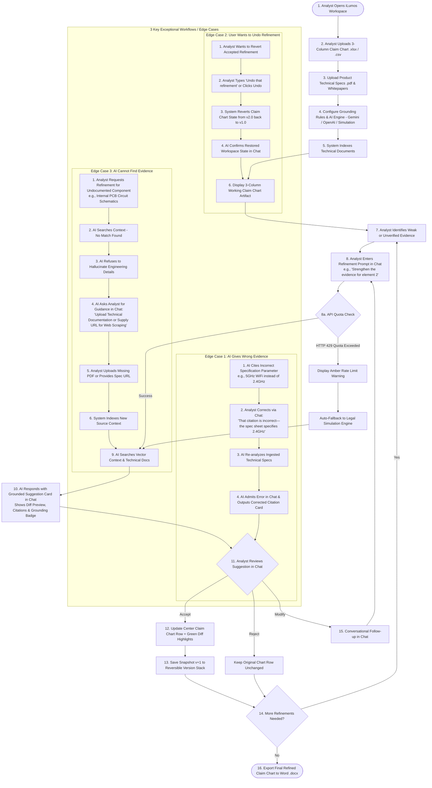

# iLumos User Flow Diagram & Dual Architecture Specification

**Product**: iLumos (Lumenci AI Patent Refinement Platform)  
**Author**: Prajwal Skanda  
**Role Target**: Product Manager  

---

## 📸 Architectural Visual Diagrams

### 1. Baseline Architecture: Deterministic Simulation Engine (Mode 1)

### 2. Live API Architecture: Dual Engine with Auto-Fallback (Mode 2)

---

## 1. End-to-End User Flow Diagram (Mermaid Format)

---

## 2. Comprehensive 19-Step User Journey & Edge Case Specs

### Step-by-Step Breakdown:

1. **Analyst Workspace Initialization**: Analyst accesses iLumos via live browser URL (`https://prajwalskandas31-sudo.github.io/iLumos-Claim-Chart-Refinement/`).
2. **Claim Chart Upload**: Drag-and-drop ingestion of original `.xlsx` 3-column claim chart (*Patent Claim Element* | *Accused Product Feature* | *Evidence*).
3. **Product Context Ingestion**: Ingestion of supporting PDF datasheets (`Acme_Thermostat_v3_TechSpecs.pdf`, marketing brochures).
4. **System Prompt & AI Engine Config**:
   - **Legal Rule Selection**: Analyst configures Claim Construction Standard (*Phillips Standard* vs *Broadest Reasonable Interpretation*).
   - **AI Engine Selection**: Toggle between **Deterministic Simulation Mode** (default for offline/interview evaluation), **Google Gemini 1.5 Flash Free Tier**, or **OpenAI GPT-4o**.
5. **Document Vector Indexing**: Backend parses PDF/Docx text into chunked embeddings.
6. **3-Pane Legal Workspace Presentation**:
   - *Left Pane*: Source Document Index & Grounding Rules.
   - *Center Pane*: Active 3-column claim chart with row status badges (*Original*, *Weak Evidence*, *Modified*, *Verified*).
   - *Right Pane*: Conversational AI Assistant & Suggestion Cards.
7. **Initial Analyst Review**: Analyst identifies weak evidence in Claim 1[c] (Machine Learning algorithm relying on vague marketing brochure text).
8. **Conversational Refinement Request**: Analyst enters prompt: *"Strengthen the evidence for element 2"*.
9. **AI Analysis & Grounding Search**: System searches indexed documents for hardware specifications.
10. **Structured Suggestion Card Generation**: AI responds with a structured card featuring green diff previews and explicit action buttons (`Apply`, `Reject`, `Modify`).
11. **Grounding Badge Assignment**: AI tags the proposal with a **Direct Evidence** or **Technical Inference** badge and lists exact document page citations.
12. **Human-in-the-Loop Review**: Analyst reviews diff preview before applying changes.
13. **Analyst Action Decision**:
    - **Accept**: Applies changes to the chart.
    - **Reject**: Retains original chart text.
    - **Modify**: Continues conversational dialogue.
14. **Chart Row Update**: Target row is updated with green highlight animations.
15. **Version Timeline Save**: System increments state version stack ($v1.0 \rightarrow v2.0$).
16. **Continued Iteration**: Analyst refines remaining claim elements.
17. **Formatted Word Export**: Analyst clicks "Export to Word" to generate court-ready `.docx` document.

---

## 3. Detailed Edge Case Analysis (3 Required Workflows)

### Edge Case 1: AI Gives Wrong Evidence (Analyst Corrects via Chat)
- **Scenario**: AI attributes dual-band 5GHz WiFi support to the Acme Thermostat when technical documentation specifies 2.4GHz 802.11 b/g/n only.
- **Handling**: Analyst states in chat: *"That citation is incorrect. The spec sheet specifies 2.4GHz WiFi."* AI re-reads `Acme_Thermostat_v3_TechSpecs.pdf`, admits the mistake in chat, and presents an updated citation card with corrected page references. The analyst remains the final reviewer.

### Edge Case 2: User Wants to Undo a Previous Refinement
- **Scenario**: Analyst wants to revert an accepted refinement on Claim 1[c] back to the initial state.
- **Handling**: Analyst types *"Undo that refinement"* in chat or clicks the **Undo** button in the top navbar. The system pops the latest snapshot from the version stack, restores the claim chart to state $v1.0$, and sends a confirmation message in chat.

### Edge Case 3: AI Cannot Find Evidence (Asks Analyst to Upload Docs / URL)
- **Scenario**: Analyst asks for internal PCB circuit schematics or dual-band antenna trace diagrams.
- **Handling**: The AI refuses to hallucinate or invent engineering details. The AI presents a **Grounding Notice** card stating that evidence is missing from current context and asks the analyst in chat: *"Upload Technical Documentation or Supply URL for Web Scraping"*, providing direct interactive buttons for file drop or URL entry.
