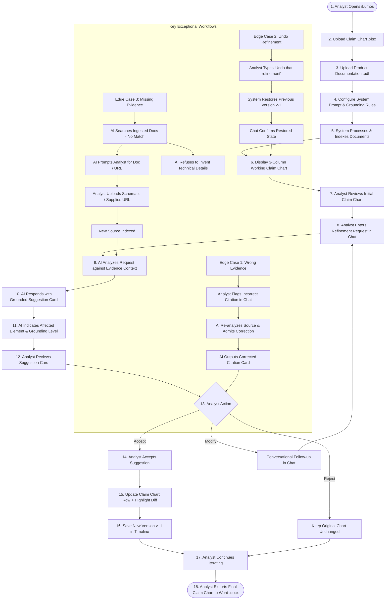

# iLumos User Flow Diagram & Architecture Specification

**Product**: iLumos (Lumenci AI Patent Refinement Platform)  
**Candidate**: Prajwal Skanda  

---

## 1. End-to-End User Flow Diagram (Mermaid)

---

## 2. Structured Step-by-Step Breakdown

| Step | User Action / System Event | Description & State Change |
|:---|:---|:---|
| **1** | Open Application | Analyst arrives at iLumos workspace onboarding screen. |
| **2** | Upload Claim Chart | Ingests `US123456_Claim_Chart.xlsx` (3 claim elements parsed). |
| **3** | Upload Product Docs | Ingests `Acme_Thermostat_v3_TechSpecs.pdf` & Whitepapers. |
| **4** | System Prompt Setup | Analyst defines grounding strictness (*Strict Quotes*) & legal standard (*Phillips*). |
| **5-7**| Display & Review Chart | 3-column table renders with Element 1[c] marked as `Weak Technical Evidence`. |
| **8-11**| Chat Request & AI Card | Analyst sends *"Add technical details for ML element"*. AI generates suggestion card. |
| **12-16**| Accept & State Update | Analyst clicks `Apply to Chart`. Row updates, diff highlights, version advances to `v2.0`. |
| **17-18**| Export Final Artifact | Analyst clicks `Export to Word`. Formatted `.docx` file downloads for litigation. |

---

## 3. Detailed Edge Case Analysis

### Edge Case 1: AI Gives Wrong Evidence
- **Scenario**: AI attributes 5GHz WiFi support to Acme Thermostat when documentation specifies 2.4GHz only.
- **Handling**: Analyst states *"This evidence is incorrect. The product doc does not say 5GHz."* AI re-reads `TechSpecs.pdf`, admits correction in chat, and presents updated citation card. Analyst remains final reviewer.

### Edge Case 2: User Wants to Undo a Refinement
- **Scenario**: Analyst wants to revert an accepted refinement on Claim 1[c].
- **Handling**: Analyst requests *"Undo that refinement"*. System pops top state from version stack, restores claim chart to `v1.0`, and notifies analyst in chat.

### Edge Case 3: AI Cannot Find Sufficient Evidence
- **Scenario**: Analyst asks for internal circuit schematics of dual-band antenna system.
- **Handling**: AI refuses to hallucinate or invent engineering details. AI displays a red **Grounding Notice** card stating missing evidence and provides direct buttons for `Upload Document` or `Add URL`.
